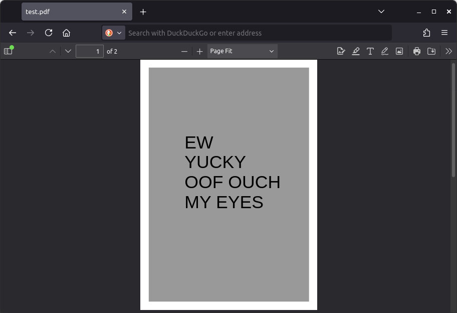
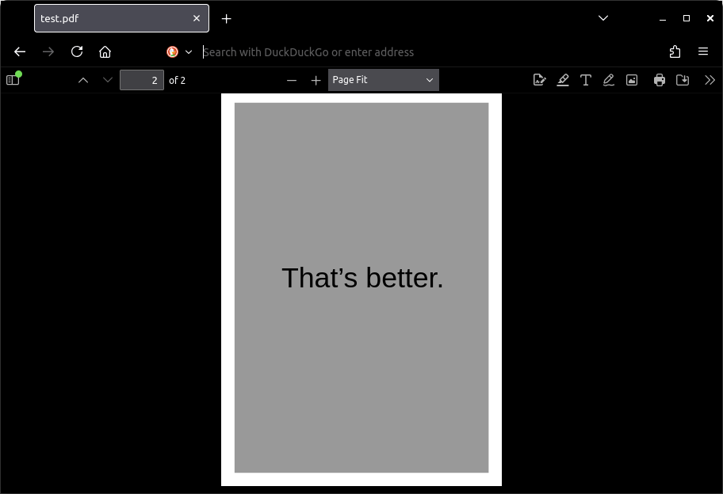

# Amoled Firefox CSS
CSS files to make Firefox UI elements darker. Firefox themes are unable to edit certain parts of the browser such as the built-in PDF viewer and the background color of letterboxed windows in [Librewolf](https://librewolf.net/). Using custom CSS, you too can black out your browser.

Firefox Dark Mode | With Amoled Firefox CSS
--- | ---
 | 

## Installation
1. Set `toolkit.legacyUserProfileCustomizations.stylesheets` to `true` in the [Config Editor](https://support.mozilla.org/en-US/kb/about-config-editor-firefox).
2. Find your currently active profile in the [Profile Manager](https://support.mozilla.org/en-US/kb/profile-manager-create-remove-switch-firefox-profiles). Navigate to the folder `/home/[username]/.var/app/org.mozilla.firefox/.mozilla/firefox/[profile]`. If there is a `chrome` folder here, open it; else, create one.
3. Move `userChrome.css` and `userContent.css` into your `chrome` folder.

### Note
- Other Firefox based browsers such as [Librewolf](https://librewolf.net/) can also be modified. The `chrome` folder would be located at `/home/[username]/.var/app/io.gitlab.librewolf-community/.librewolf/[profile]/chrome/` instead.
- If you're still using [Windows](https://www.youtube.com/watch?v=dQw4w9WgXcQ), the `chrome` folder would be located at `C:\Users\[username]\AppData\Roaming\Mozilla\Firefox\Profiles\[profile]\chrome`.
